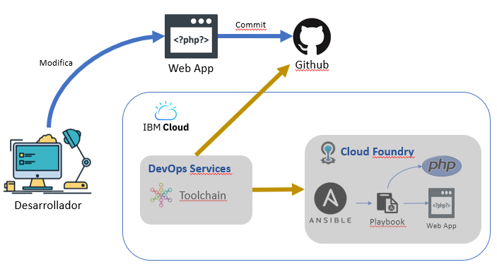
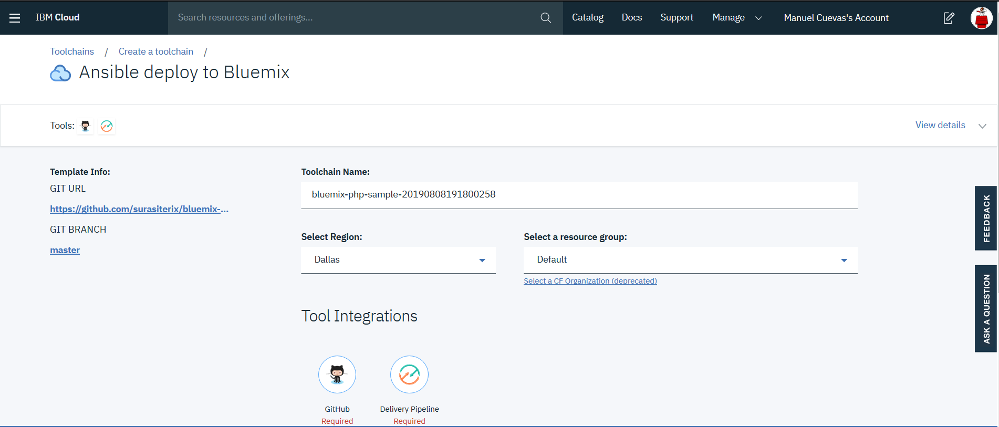
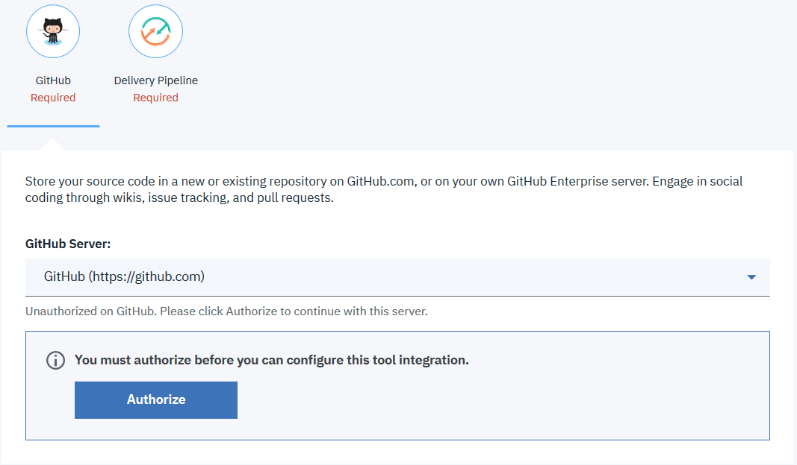
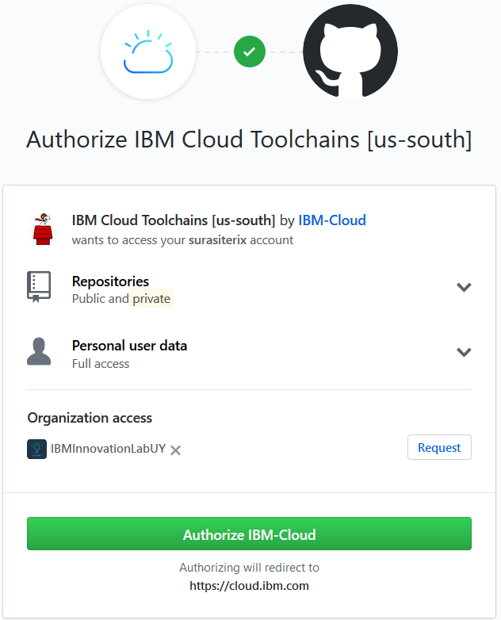
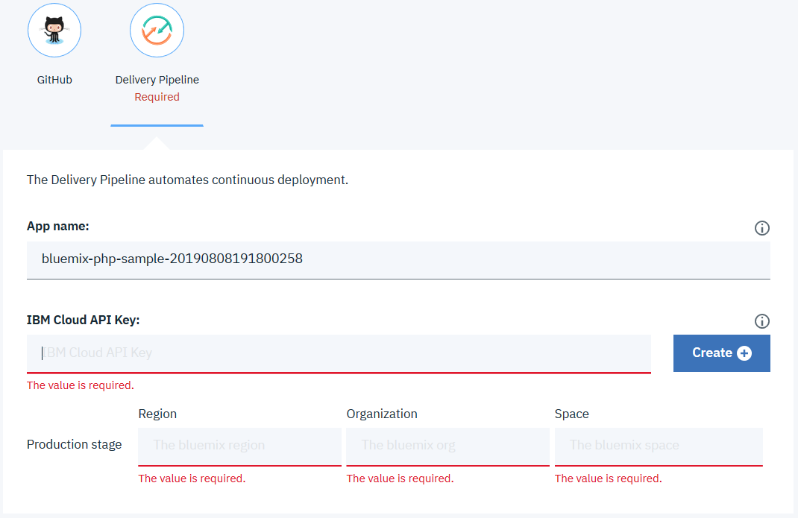
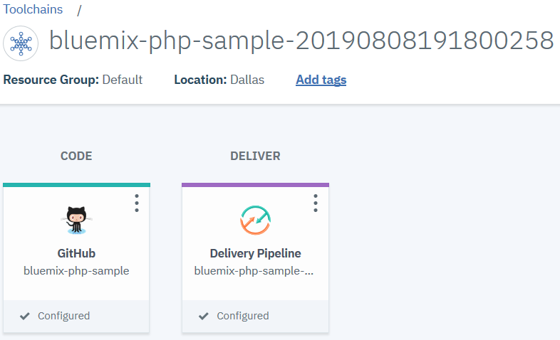
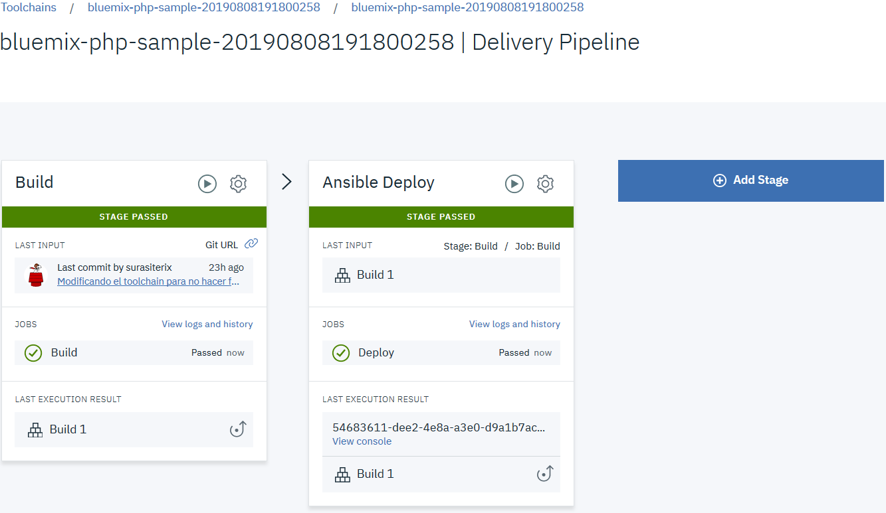

# Ansible-Code-Day

  Bienvenido al taller para Ejecutar playbooks de Ansible desde un delivery pipeline en IBM Cloud.

## Características del taller

  * **Nivel de skill**: Cualquier nivel de skill

  Se requiere conocimientos básicos de Git e IBM Cloud.

  [Ansible](https://www.ansible.com/overview/how-ansible-works) es una simple, pero potente, tecnología para automatizar despliegues y configuración de aplicaciones sin utilizar agentes para ello. En este taller, aprenderás como ejecutar un playbook de ansible para desplegar una aplicación web simple, hecha en PHP, en Cloud Foundry ofrecido en la nube de IBM.

## Requisitos ##

  * Cuenta en IBM Cloud - Crea tu IBMid desde este enlace https://ibm.biz/Bd26aa
  * Cuenta en Github - Creat tu ususario desde este enlace https://github.com

## Introducción ##

  El objetivo de este taller es explorar como integrar Ansible a cualquier delivery pipeline para poder automatizar tanto el despliegue como la configuración de componentes para una aplicación en la nube.

  Primero, prepararemos un entorno de desarrollo donde trabajaremos en una aplicación web realizada en PHP. Será el entorno donde el desarrollador hace sus pruebas unitarias y valida el desarrollo de nuestra aplicación Web  



  Posteriormente, construiremos un toolchain que tome el desarrollo de Github para luego construir, usando Ansible, el entorno de nuestra aplicación para desplegarla en Cloud Foundry.

## Paso a Paso

  Listos para el despegue!

### 1. Preparar el repositorio de trabajo en github

  - Conectate a Github con tus credenciales de usuario
  - Accede a este repositorio **surasiterix/bluemix-php-sample**
  - crea un _fork_ del repositorio
  - Ahora vamos a hacer las siguientes modificaciones:
    - Archivo **README.md**. Ubica, cerca del final, Buscamos el Botón \[Crear Toolchain\]

    Vamos a modificar reemplazando la dirección del repositorio por el que acabamos de crear: Quedando de esta forma: ```https://console.ng.bluemix.net/devops/setup/deploy/?repository=https://github.com/{Nombre de usuario}/bluemix-php-sample)```
      - Archivo **.bluemix/toolchain.yml**. Buscamos este extracto en el archivo

  ``` yaml
    # Github repos
    sample-repo:
      service_id: githubpublic
      parameters:
        repo_name: "{{name}}"
        repo_url: https://github.com/surasiterix/bluemix-php-sample
        type: existing
        has_issues: false
  ```

  Y lo modificamos por:

  ``` yaml
    # Github repos
    sample-repo:
      service_id: githubpublic
      parameters:
        repo_name: "{{name}}"
        repo_url: https://github.com/{Nombre de usuario}/bluemix-php-sample
        type: existing
        has_issues: false
  ```

### 2. Explorar componentes de nuestro ejemplo

  A continuación daremos una mirada a los componentes que nuestra aplicación va a manejar y como fueron configurados

  - **Aplicación Web**:
    - _index.php_ Es el landing page de nuestra Aplicación
    - _style.css_ Es la hoja de estilos que aplican a nuestra aplicación Web
    - _/images_: Es el directorio con las imágenes que componen nuestra aplicación Web
  - **Configuración de Cloud Foundry**
    - _manifest.yml_ Contiene las definiciones que precisamos para nuestro runtime en la nube
  - **Ansible**
    - _setup-tools/install_ansible.sh_ Shell script para ejecutar la instalación de Ansible en el runtime de Cloud Foundry
    - _.playbook.yml_: Playbook de Ansible que se encargará de preparar nuestro entorno PHP y desplegar nuestra aplicación en Cloud Foundry
  - **Toolchain**:
    - _.bluemix_ Directorio con la configuración de nuestra toolchain para disparar el aprovisionamiento y despliegue de nuestra aplicación Web

### 3. Creando el ambiente de desarrollo

  Ya casi estamos, ahora vamos a crear el entorno de desarrollo. Para ello vamos a seguir los pasos que se decriben en el README.md de nuestro nuevo repositorio **bluemix-php-sample**

  La aplicación web debe lucir como esto:


### 4. Configuremos nuestra toolchain

  Al momento de presionar el botón para crear nuestra toolchain debemos ver esta pantalla



  Veremos que el ícono de Github como el del delivey pipeline requieren realizar ciertas acciones:

  - Autorizar acceso a github

    Al presionar el ícono de github debemos pulsar el botón "Authorize". En la nueva ventana, pulsar "Authorize IBM-Cloud"





  - Crear API Key para conectar el Delivery Pipeline a IBM Cloud

    Pulsando el ícono del Delivery Pipeline, debemos crear la API key



  Hay que validar que los campos de Región, Orgranización y Space estén llenos. Finalizamos pulsando el botón "Create".

  El resultado final luce de esta forma



### 5. Ejecución de la ToolChain

  En este instante, nuestra aplicación está desplegandose. Luego de unos minutos debemos ver estos resultados de la Ejecución


